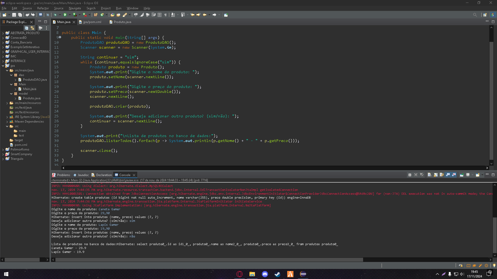

# Lista de Exercícios - Atividade individual - JPA

Projeto da matéria de POO FACENS

## 🚀 Começando

* CRIE UM PROJETO EM JAVA E REPRODUZA O EXEMPLO DO SOBRE O TEMA DA AULA DE JPA;
* NO EXEMPLO, SERÁ NECESSÁRIO UTILIZAR O WAMP PARA ACESSO DO BANCO DE DADOS MYSQL, CONFIRA INFORMAÇÕES NO CONTEÚDO DA AULA 11 - WAMP;
* APÓS A CONFIGURAÇÃO DO AMBIENTE, CRIAÇÃO DO PROJETO MAVEN E SUAS RESPECTIVAS CLASSES;
* AO TÉRMINO CRIE UM REPOSITÓRIO REMOTO COM NOME JPA;
* PARA ENTREGA DENTRO DO README.MD INSIRA AS SEGUINTES IMAGENS:
* TESTE DO PROJETO FUNCIONANDO NO CONSOLE.

* SERÁ ACEITO O USO DE OUTRAS BASES DE DADOS;
* NÃO SERÁ ACEITO A INSERÇÃO DOS MESMOS DADOS CONFORME A IMAGEM DE EXEMPLO;
* AS IMAGENS DEVEM COMPOR O README.MD DO PROJETO;
* ESTÁ ATIVIDADE É VALIDA PARA AVALIAÇÃO FINAL.

## 🛠️ Construído com

* EclipseIDE
* WampServer

## 📌 Versão

* **Versão 1.0** 

## ✒️ Autores

* **Gabriel Alesiunas** - *JPA* 
